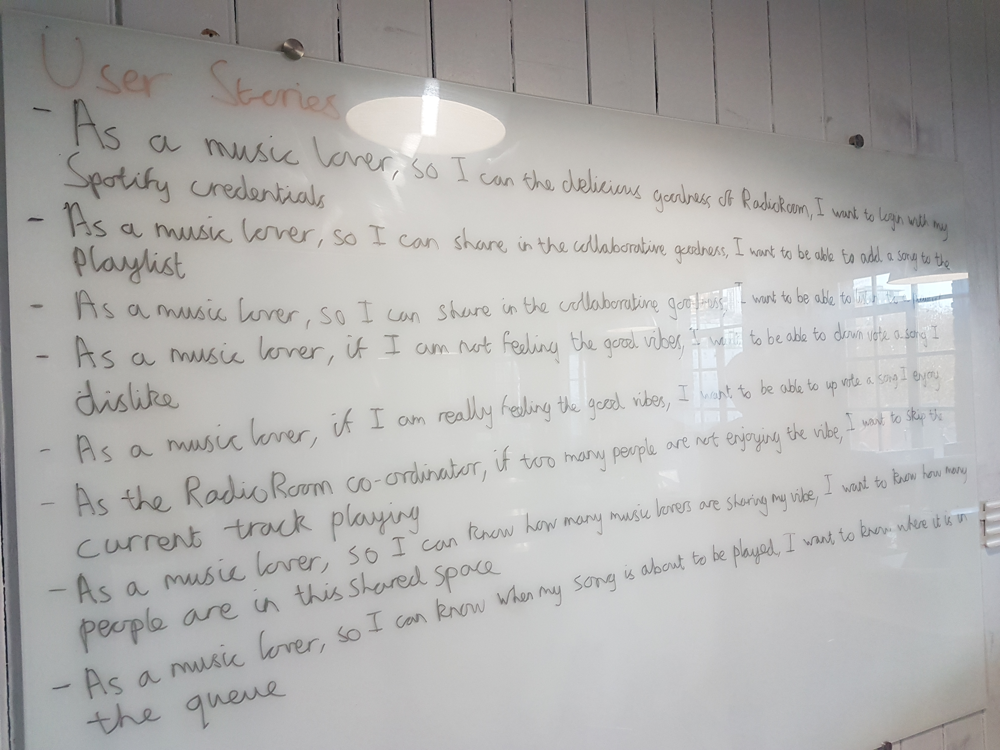

# RadioRoom

A music media application that allows users to share, sync, discuss and listen to music in a collaborative space.

This is the Minimal Viable Product (MVP) definition of RadioRoom.

## MVP Interactions

- login with Spotify
- enter radioroom
- add song to playlist
- listen to current song playing (auto?)
- vote on current song
- skip song if most people don't like it

## MVP Use Cases

```
As a music lover
So I can access the delicious goodness of RadioRoom
I want to login with my Spotify credentials
```

```
As a RadioRoomer
So I can find the song that I want to listen to
I want to search by artist and song title
```

```
As a RadioRoomer
So I can listen to a song that I like and share it with others
I want to add it to the room's playlist
```

```
As a RadioRoomer
So I can show my love for the current song
I want to upvote it
```

```
As a RadioRoomer
So I can show my distaste for the current song
I want to downvote it
```

```
As a RadioRoomer
So I can see the popularity of the current song
I want to see a visual gauge
```

```
As a RadioRoom coordinator
So I can keep the happy vibes going
I want to be able to skip the current song if it is unpopular
```

```
As a RadioRoomer
So I know many fellow roomer's are sharing the cool vibes
I want to see the number of people in the room
```

```
As a impatient RadioRoomer
So I know when my next song is going to be played
I want to see where the song is in the queue
```



## MVP UI Sketch


